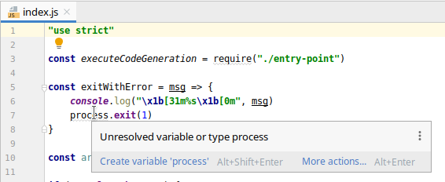
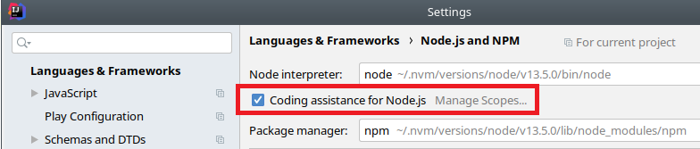
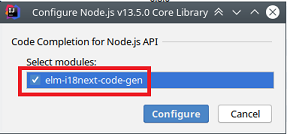

# Code Generation for [elm-i18next](https://package.elm-lang.org/packages/ChristophP/elm-i18next/latest)

## Overview
TODO

### Note for IntelliJ users
When first opening the project, you might see some warnings about unresolved variables in node-specific code:

To get round this go to **Settings --> Languages & Frameworks --> Node.js and NPM** and tick the
**Coding assistance for Node.js** checkbox:

Then, when prompted, select the `elm-i18next-code-gen` module:

