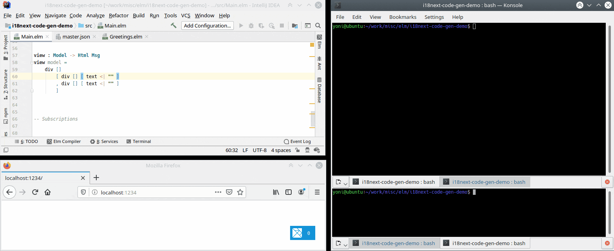

# Code Generation for [elm-i18next](https://package.elm-lang.org/packages/ChristophP/elm-i18next/latest)

[](https://github.com/yonigibbs/elm-i18next-gen/actions)


## Overview
`elm-i18next-gen` is a tool for handling internationalization in Elm projects. It combines type safety with dynamic
translation loading, allowing for a smoother translation process and smaller bundles than some other solutions, while
maintaining type safety.

This tool generates code which uses the [elm-i18next](https://package.elm-lang.org/packages/ChristophP/elm-i18next/latest)
package to read text values from a source JSON object. If a change is made to the source JSON object `elm-i18next-gen`
ensures the corresponding change required in the code is found at compile-time, not at runtime. This means you don't need
to worry about translations being out-of-sync with the code.


## Pre-requisites
`elm-i18next-gen` requires Node 10 or higher.


## Installation
Install `elm-i18next-gen` from npm:

```shell script
npm install --save-dev elm-i18next-gen
```


## Getting Started
This section assumes you are not already using the `elm-i18next` package. If this doesn't apply to you, please see the
[next section](#adding-to-a-project-already-using-elm-i18next).

1. Install `elm-i18next` by running this at the root of your project:
    ```shell script
    elm install ChristophP/elm-i18next
    ```

1. Create a JSON file containing your translations. There will one of these for each language you support, but
`elm-i18next-gen` only requires one (generally the one that you treat as your "primary" language, that you update as
you're writing the code). As an example, let's imagine your JSON file is called `translations.en.json` and looks as follows:

   ```json
   {
     "welcome": "Welcome back, {{name}}",
     "logout": "Click here to log out"
   }
   ```

1. Update the JavaScript code which initializes your Elm code and pass in the JSON from the file above in the `flags`, e.g.:

   ```js
   Elm.Main.init({ flags: translations });
   ```
   
   Here, `translations` can either be a JavaScript object literal or a string containing the JSON. Typically this would
   be fetched from somewhere, e.g.:
   
   ```js
   const translations = await fetch('/path/to/files/translations.en.json');
   Elm.Main.init({ flags: translations });
   ```
   
   Alternatively it could be pre-rendered into the JavaScript on the server-side, or it can be fetched from within the
   Elm code itself, as mentioned [here](https://github.com/ChristophP/elm-i18next/tree/master#fetching-translations).
   
   The JavaScript code, or the server-side code generating the JavaScript, can choose the relevant translation file for
   the current user. For example the server could do this based on the user's locale by interrogating the
   [Accept-Language](https://developer.mozilla.org/en-US/docs/Web/HTTP/Headers/Accept-Language) HTTP header.

1. Update your Elm code by creating a field in your model to store the translations, and initializing it with the data
from the `flags`, e.g.:

   ```elm
   import I18Next
   import Json.Encode
   import Json.Decode
   
   type alias Model = {
       translations: I18Next.Translations
   }
   
   init : Json.Encode.Value -> (Model, Cmd msg)
   init flags =
       case Json.Decode.decodeValue I18Next.translationsDecoder flags of
           Ok translations ->
               ( Model translations, Cmd.none )
   
           Err err ->
               -- handle the error
   ```

1. Run `elm-i18next-gen` to generate functions that will provide access to the translations above. As an example, let's
imagine your project is structured as follows:

   ```
   my-project/
   ├── src/
   |   ├── index.html
   |   ├── index.js
   |   ├── Main.elm
   ├── translations/
   |   ├── translations.en.json
   |   ├── translations.fr.json
   ├── package.json
   ├── elm.json
   ```
   
   From the root of the project (i.e. in the `my-project` folder in the example above) run the following:
   
   ```shell script
   npx elm-i18next-gen --source translations/translations.en.json --target src
   ```
   
   _(Note that if you run the command above more than once, it will fail. Simply add `--overwrite` to get round this. See
   [Command-line Arguments](#command-line-arguments) for more information.)_
   
   This will create a file called `src/Translations.elm`. This is an Elm module that you can import into your code. In
   this module there will be one function per translation in the JSON file. You can use it as shown below. (As an example
   here let's assume there's a `username` field on the model.)
   
   ```elm
   import Translations
   
   view : Model -> Html Msg
   view model =
       div []
           [ div [] [ text <| Translations.welcome model.translations model.username ]
   ```
   

### Adding to a project already using `elm-i18next` 
If you are already using `elm-i18next` you can integrate `elm-i18next-gen` into your project quite easily. Install it
as per the [installation instructions](#installation), and run it as explained in the last point above. You can now
import the generated `Translations.elm` module into your code and start using it instead of calling the existing
functions from `elm-i18next`. You can either leave existing code as it is, or migrate it to use the new generated code:
using the the generated functions alongside the existing `elm-i18next` functions is fine.

One point to note is that the generated module is called `Translations`, but there's already a module in `elm-i8next` of
the same name. So when importing you'll need to use fully qualified imports or an alias to distinguish between the two.


## Motivation
_This section explains why `elm-i18next-gen` was written, and why you might want to use it. If you're not interested,
and just want more detailed information on using it, skip to the [Usage](#usage) section below._

In Elm there are various approaches to solve the problem of internationalization, including
[elm-i18n](https://github.com/iosphere/elm-i18n), [i18n-to-elm](https://github.com/dragonwasrobot/i18n-to-elm),
[elm-i18n-module-generator](https://github.com/ChristophP/elm-i18n-module-generator) and
[elm-i18next](https://github.com/ChristophP/elm-i18next). Each of these takes a different approach, and each is suited
to slightly different use cases. For a recent project, I chose to use `elm-i18next-gen` for various reasons:
* I didn't want to build a separate version of the app for each language.
* I didn't want to pass the user's language around the model.
* I didn't want to download the translations for every language to the user, when they only ever use one.
* I didn't want to have to rebuild and redeploy the client code every time translations for a new language were added.

`elm-i18next` ticks all the boxes above. The one thing I wanted that the package didn't give me is compile-time checking
of my code against the source JSON object containing the translations. For example, say the JSON object contains this
translation:

```json
{
  "greetName": "Hi {{name}}"
}
```

The Elm code to call this would look as follows:

```elm
tr model.translations Curly "greetName" [ ( "name", "Peter" ) ]
```

However the following Elm code would also compile:

```elm
tr model.translations Curly "gretName" [ ( "nam", "Peter" ) ]
```

There are two typos there, neither of which would be caught at compile time, leading to problems (though not exceptions:
this is Elm after all :relaxed:) when the page is rendered.

To solve this problem, `elm-i18next-gen` takes in a JSON file containing the translations, and generates a function for
each string value. That function itself simply calls the `elm-i18next` package. The code in the application calls the
generated functions rather than using `elm-i18next` directly.

Using the example above, the generated code for it would look as follows:

```elm
greetName : Translations -> String -> String
greetName translations name =
    tr translations Curly "greetName" [ ( "name", name ) ]
```

The application code would then have the following:

```elm
greetName model.translations "Peter"
```

Now if a developer types `gretName` the code won't compile. And as the placeholder `name` is now baked into the generated
code, there isn't an opportunity for any mistakes there. Similarly if a new placeholder is added in the text: the
generated function will now require two parameters instead of one so the required change to the calling code will be
spotted at compile time.

An important point here is that the generated code does not contain the actual translated value (e.g. `"Hi {{name}}"`).
These values are still read from the source JSON object at runtime. This means that as new languages are added, or as
string values are updated, the code doesn't have to change (unless of course the translation IDs or placeholders change).


## Usage
`elm-i18next-gen` can be run directly using `npx` or by adding a new entry to the `scripts` section of `package.json`
then using `npm run`.

To run with `npx` execute this at the root of your project:

```shell script
npx elm-i18next-gen ... [see below for args]
```

To use `npm run` add this to `package.json`:

```
{
  ...
  "scripts": {
    "generate-translations": "elm-i18next-gen ... [see below for args]"
    ...
```

Then execute this at the root of your project:

```shell script
npm run generate-translations
```

(The name of the script, in this example `generate-translations`, can be whatever you want.)


### Command-line Arguments
In order to run, this `elm-i18next-gen` requires two command-line arguments to be supplied:
* `--source` (short form `-s`): The source file containing the JSON which contains the translations.
* `--target` (short form `-t`): The folder in which the source files are to be generated. Can be absolute or relative to
current folder.

Without these this tool cannot run.

Optionally, the following arguments can also be supplied:
* `--overwrite` (short form `-o`): Ensures that if the any of the target files exist, they will be overwritten. If this
argument isn't supplied and any of the target files exist, the process will abort. See the [Overwriting](#overwriting)
section below for further details.
* `--watch` (short form `-w`): Watches the source file for changes and regenerates the code whenever it does.
* `--fallback` (short form `-f`): Generates functions which receive a list of fallback languages. The generated functions
will use [tf](https://package.elm-lang.org/packages/ChristophP/elm-i18next/latest/I18Next#tf) and
[trf](https://package.elm-lang.org/packages/ChristophP/elm-i18next/latest/I18Next#trf) instead of
[t](https://package.elm-lang.org/packages/ChristophP/elm-i18next/latest/I18Next#t) and
[tr](https://package.elm-lang.org/packages/ChristophP/elm-i18next/latest/I18Next#tr).

Details on the command-line arguments are also available by running with the `--help` argument.

Below is an example of running `elm-i18next-gen` using `npx`, including the arguments:

    npx elm-i18next-gen --source translations/master.json --target src --overwrite

`elm-i18next-gen` can also be integrated into your regular build script. For example say you happen to be using
[parcel](https://parceljs.org/) to bundle your build, and your `package.json` contains this:

```json
"scripts": {
  "build": "parcel build ...",
  "generate-translations": "elm-i18next-gen -s translations/master.json -t src -o"
```

The `build` script can be updated to call `generate-translations` as follows:

```json
"build": "npm run generate-translations && parcel build ..."
```

#### Watch Mode
Activating `watch` mode by passing in `--watch` (or `-w`) keeps `elm-i18next-gen` running and watching the source file
for changes. Whenever a change occurs, the code will be regenerated. Adding this argument implicitly sets `overwrite` to
true, otherwise it would fail every time after the first code generation.

This mode is useful when doing a lot of work on translations and wanting changes in the translation file to be made
immediately available in the code. It can also give immediate feedback on what changes need to be made in the code if
the translation file changes break the existing code. This is shown in the video below. Here
[parcel](https://parceljs.org/) is serving the app, ensuring the code is compiled as soon as any changes are made to it.
Therefore when the translation file is updated `elm-i18next-gen` automatically updates the generated code, which causes
parcel to rebundle the app.




### Generated Code
#### Files & Module Structure
`elm-i18next-gen` will generate a file called `Translations.elm` in the specified `target` folder. In it, it will create
a function for every string value in the source JSON. In the source JSON, however, not every key represents a string:
some keys are used as parents to group together other string values:

```
{
  "hello": "Hello",             <-- This is a string value
  "greetings": {                <-- This is a grouping of string values
    "goodDay": "Good day.",
    "greetName": "Hi {{name}}"
  }
}
```

For every such "grouping", an Elm module will be generated. So for the example JSON above, the following structure will
be created in the `target` folder:

* `Translations.elm`: contains the `hello` function.
* `Translations/Greetings.elm`: a `Translations` folder will be created under the `target` folder, and this file will be
put there. This file will contain the `goodDay` and `greetName` functions.

Modules can be nested as deeply as desired.


#### Module/Function/Parameter Names
`elm-i18next-gen` will generate valid and idiomatic Elm code for the values in the source JSON. Often the generated
Elm items (e.g. function names) will directly match the source JSON keys, but in some cases there might be differences.
This is because the rules and normal usage of JSON and Elm are a bit different. For example, in Elm a function must start
with a lower case letter, have no spaces or dashes, and by convention `camelCase` in used. In JSON, however, `kebab-case`
perfectly valid, and keys can be lower or upper case.

Because of this, `elm-i18next-gen` "sanitises" the JSON keys before generating the Elm code. For example the JSON key
`greet-user` will be converted into an Elm function called `greetUser`. This also applies to generated modules and
parameters.

This is all fairly intuitive. There is however one case where no completely intuitive solution is obvious: where a JSON
key starts with a number. This is not valid in Elm as modules/functions/parameters must start with a letter. Therefore
in such cases the module/function/parameter will be prefixed with `T` (for modules) or `t` (for functions and parameters).
(`T` is used as shorthand for "Translation".)


### Overwriting
As explained above, the `overwrite` argument defines whether or not the code generation process should overwrite any
existing files. If the `overwrite` flag isn't specified the logic is quite simple: the operation will only proceed if
`Translations.elm` does not exist and the `Translations` folder doesn't exist (or is empty). If `overwrite` is specified
and there are no submodules, again the logic is simple: `elm-i18next-gen` will simply overwrite that file. However if
`overwrite` is specified and there are submodules, a complexity can arise...

Taking the example JSON above, we saw that two files were generated: `Translations.elm` and `Translations/Greetings.elm`.
Now imagine the `greetings` key in the source JSON was renamed to `welcomeMessages`. What should happen here? Obviously
a file called `Translations/WelcomeMessages.elm` should be created, but what should happen to the previously generated
`Translations/Greetings.elm`? Similarly, what if the `greetings` section in the JSON was completely removed? Now there's
no need for the `Translations` folder at all, as there are no submodules to generate. So what should happen with the
previously created `Translations` folder?

The way `elm-i18next-gen` handles this is by deleting any files and folders previously generated in the `Translations`
folder, if the newly supplied JSON no longer references them. It also deletes the `Translations` folder itself if it's no
longer required. Clearly this is potentially dangerous: files are being deleted! If you'd like to use this tool but don't
like this (i.e. you'd prefer the files to be put in the trash can / waste bin / recycle bin instead) please log an issue.


## Future Enhancements
Below is a list of possible future enhancements to add to `elm-i18next-gen`. If any of these are important to you, please
log an issue and I'll try my best to implement them as soon as I can.
* Allow parameter delimiter to be configured (currently hard-coded to `Curly`).
* Allow user more control over generated files (e.g. hard-coded default of "Translations" as top-level module).
* Update handling of errors in JSON: provide a list of all errors rather than fail as soon as an error is hit?


## Thanks
* Thanks to [ChristophP](https://github.com/ChristophP), author of [elm-i18next](https://github.com/ChristophP/elm-i18next),
for his library, and for taking the time to chat about the idea of code generation for it, and providing great feedback.
* Thanks to [Dillon Kearns](https://github.com/dillonkearns) for the original inspiration for increased type safety using
code generation, from his [elm-graphql](https://github.com/dillonkearns/elm-graphql) library, especially
[this talk](https://www.youtube.com/watch?v=memIRXFSNkU) of his.
