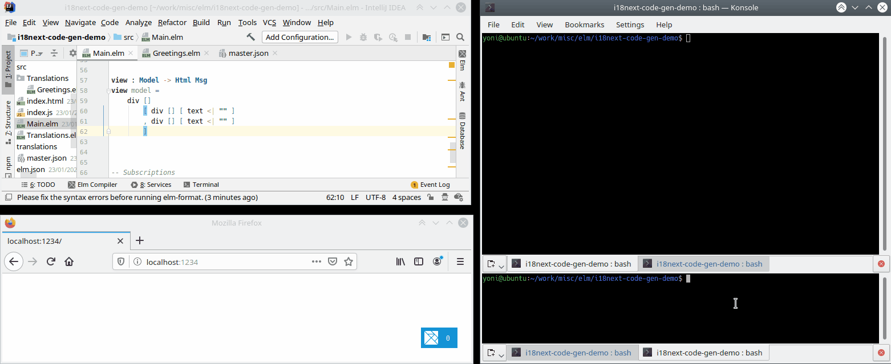

# Code Generation for [elm-i18next](https://package.elm-lang.org/packages/ChristophP/elm-i18next/latest)

## Overview
This tool generates code which can be added to an Elm project to allow it handle internationalization in a typesafe
manner. The code it generates uses the [elm-i18next](https://package.elm-lang.org/packages/ChristophP/elm-i18next/latest)
package to read text values from a source JSON object. If a change is made to the source JSON object this tool will ensure
the corresponding change that is required in the code is found at compile-time, not at runtime.

## Motivation
In Elm there are various approaches to solve the problem of internationalization, including
[elm-i18n](https://github.com/iosphere/elm-i18n), [i18n-to-elm](https://github.com/dragonwasrobot/i18n-to-elm),
[elm-i18n-module-generator](https://github.com/ChristophP/elm-i18n-module-generator) and
[elm-i18next](https://github.com/ChristophP/elm-i18next). Each of these takes a different approach, and each is suited
to slightly different use cases. For a recent project, I chose to use *elm-i18next* for various reasons:
* I didn't want to build a separate version of the app for each language.
* I didn't want to pass the user's language around the model.
* I didn't want to download the translations for every language to the user, when they only ever use one.
* I didn't want to have to rebuild and redeploy the client code every time translations for a new language were added.

*elm-i18next* ticks all the boxes above. The one thing I wanted that the package didn't give me is compile-time checking
of my code against the source JSON object containing the translations. For example, say the JSON object contains this
translation:

    {
      "greetName": "Hi {{name}}"
    }

The Elm code to call this would look as follows:

    tr model.translations Curly "greetName" [ ( "name", "Peter" ) ]

However the following Elm code would also compile:

    tr model.translations Curly "gretName" [ ( "nam", "Peter" ) ]

There are two typos there, neither of which would be caught at compile time, leading to problems (though not exceptions:
this is Elm after all :relaxed:) when the page is rendered.

To solve this problem, the tool in this repo takes in a JSON file containing the translations, and generates a function
for each string value. That function itself simply calls the _i18next_ package. The code in the application then calls
those generated functions rather than using the _i18next_ package directly.

Using the example above, the generated code for it would look as follows:

    greetName : Translations -> String -> String
    greetName translations name =
        tr translations Curly "greetName" [ ( "name", name ) ]

The application code would then have the following:

    greetName model.translations "Peter"

Now if a developer types `gretName` the code won't compile. And as the placeholder `name` is now baked into the generated
code, there isn't an opportunity for any mistakes there. Similarly if a new placeholder is added in the text: the
generated function will now require two parameters instead of one so the required change to the calling code will be
spotted at compile time.

An important point here is that the generated code does not contain the actual translated value (e.g. `"Hi {{name}}"`).
These values are still read from the source JSON object at runtime. This means that as new languages are added, or as
string values are updated, the code doesn't have to change (unless of course the translation IDs or placeholders change). 

## Installation
This package is not currently published to the npm registry, but hopefully will be soon. In the meantime to install it
run the following command, which will install it directly from this GitHub repo:

    npm install --save-dev https://github.com/yonigibbs/elm-i18next-code-gen.git
 

## Usage
The tool can be run directly using `npx` or by adding a new entry to the `scripts` section of `package.json` then using
`npm run`.

To run with `npx` execute this at the root of your project:

    npx elm-i18next-code-gen ... [see below for args]

To use `npm run` add this to `package.json`:

    {
      ...
      "scripts": {
        "code-gen-translations": "elm-i18next-code-gen ... [see below for args]"
        ...

Then execute this at the root of your project:

    npm run code-gen-translations

(The name of the script, in this example `code-gen-translations`, can be whatever you want.)

### Command-line Arguments
In order to run, this tool requires two command-line arguments to be supplied:
* `--source` (short form `-s`): The source file containing the JSON which contains the translations.
* `--target` (short form `-t`): The folder in which the source files are to be generated. Can be absolute or relative to
current folder.

Without these the tool cannot run.

Optionally, the following arguments can also be supplied:
* `--overwrite` (short form `-o`): Ensures that if the any of the target files exist, they will be overwritten. If this
argument isn't supplied and any of the target files exist, the process will abort.
* `--watch` (short form `-w`): Watches the source file for changes and regenerates the code whenever it does.

Below is an example of running this tool using `npx`, including the arguments:

    npx elm-i18next-code-gen --source translations/master.json --target src --overwrite

The tool can also be integrated into your regular build script. For example say you happen to be using
[parcel](https://parceljs.org/) to bundle your build, and your `package.json` contains this:

    "scripts": {
      "build": "parcel build ...",
      "code-gen-translations": "elm-i18next-code-gen -s translations/master.json -t src -o"

The `build` script can be updated to call `code-gen-translations` as follows: 

    "build": "npm run code-gen-translations && parcel build ..."

#### Watch Mode
Activating `watch` mode by passing in `--watch` (or `-w`) keeps the tool running and watching the source file for changes.
Whenever a change occurs, the code will be regenerated. Adding this argument implicitly sets `overwrite` to true,
otherwise it would fail every time after the first code generation.

This mode is useful when doing a lot of work on translations and wanting changes in the translation file to be made
immediately available in the code. It can also give immediate feedback on what changes need to be made in the code if
the translation file changes break the existing code. This is shown in the video below. Here 
[parcel](https://parceljs.org/) is serving the app, ensuring the code is compiled as soon as any changes are made to it.
Therefore when the translation file is updated the code generation tool automatically updates the generated code, which
causes parcel to rebundle the app.

## TODO
* Add more info in readme:
  * Describe submodules
  * Describe overwriting
* Revisit idea of deleting files in Translations folder: is this safe? Can we put them in wastebin instead?
(https://github.com/sindresorhus/trash ?)
* Add comment at top of generated files to explain they are generated.
* Handle duplicates (functions and modules).
* Add command-line-usage (i.e. handle `--help`): see https://github.com/75lb/command-line-usage (or swap to commander?)
* Validation of supplied target folder (valid path, not a file, etc.)
* Tests for all cmd-line args/behaviour (e.g. watch).
* Allow parameter delimiter to be configured (currently hard-coded to `Curly`).
* Handle translations with fallbacks.
* Allow to work with older versions of Node (which didn't have recursive folder creation).
* TODOs in the code.
* Allow user more control over generated files (e.g. hard-coded default of "Translations" as top-level module).
* Publish as NPM package?

## Maintaining
### Note for IntelliJ users
When first opening the project, you might see some warnings about unresolved variables in node-specific code:

To get round this go to **Settings --> Languages & Frameworks --> Node.js and NPM** and tick the
**Coding assistance for Node.js** checkbox:

Then, when prompted, select the `elm-i18next-code-gen` module:

## Thanks
* Thanks to [ChristophP](https://github.com/ChristophP), author of [elm-i18next](https://github.com/ChristophP/elm-i18next)
for his library, and for taking the time to chat about the idea of code generation for it.
* Thanks to [Dillon Kearns](https://github.com/dillonkearns) for the original inspiration from his
[elm-graphql](https://github.com/dillonkearns/elm-graphql) library (especially
[this talk](https://www.youtube.com/watch?v=memIRXFSNkU) of his).
